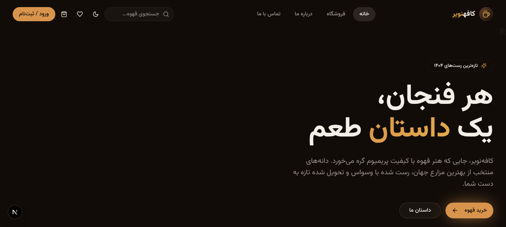
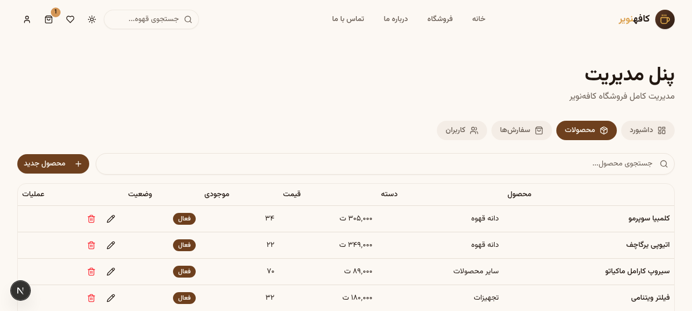
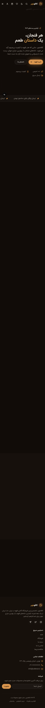
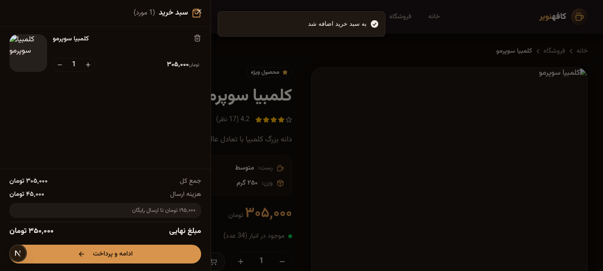
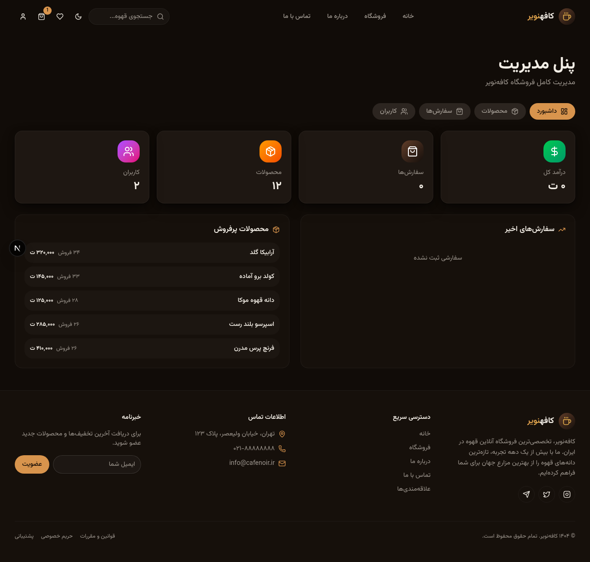

<div align="center">

# ☕ Café Noir | کافه‌نویر

### A Premium, Modern Coffee E‑Commerce Platform

**فروشگاه آنلاین قهوه تخصصی — تجربه‌ای مدرن، سریع و حرفه‌ای**

[](https://nextjs.org/)
[](https://react.dev/)
[](https://www.typescriptlang.org/)
[](https://tailwindcss.com/)
[](https://www.prisma.io/)
[](https://next-auth.js.org/)
[](./LICENSE)

[✨ Features](#-features) · [🚀 Quick Start](#-quick-start) · [📸 Screenshots](#-screenshots) · [📦 Architecture](#-architecture) · [🛠️ Scripts](#️-scripts) · [🤝 Contributing](#-contributing)

</div>

---

## 📖 Overview

**Café Noir** is a production‑ready, full‑stack e‑commerce platform for specialty coffee. Built with the modern Next.js 16 stack, it delivers a premium shopping experience with a Persian (RTL) interface, glass‑morphism design, smooth animations, and a complete admin dashboard.

> طراحی شده با عشق برای عاشقان قهوه — از مزرعه تا فنجان شما.

---

## ✨ Features

### 🛍️ Shopping Experience
- 🏠 **Landing Page** — Cinematic hero, featured products, testimonials, story section
- 🛒 **Shop** — Advanced filtering (category, roast level, price range), search, sort, pagination
- 📦 **Product Detail** — Image gallery, specs, quantity selector, reviews & rating system
- 🛒 **Smart Cart** — Animated drawer, persistent storage, real‑time totals
- 💳 **Checkout** — Complete order flow with address form and order confirmation
- ❤️ **Wishlist** — Save favorites, syncs with server when logged in

### 🔐 Authentication
- 📝 Registration / Login / Logout
- 🔑 Password recovery flow
- 🛡️ Role‑based access control (Admin / User)
- ✉️ Email verification ready

### 👑 Admin Dashboard
- 📊 **Stats** — Revenue, orders, products, users, top products
- 📦 **Product Management** — Full CRUD with modal editor
- 🚚 **Order Management** — Status updates (pending → processing → shipped → delivered)
- 👥 **User Management** — Role assignment, user deletion

### 🎨 Design & UX
- 🌗 **Dark / Light Mode** — System‑aware theme with smooth transitions
- 📱 **Fully Responsive** — Mobile‑first, optimized for all devices
- ✨ **Premium Animations** — Framer Motion throughout
- 🎯 **Glass‑morphism UI** — Frosted glass cards, soft shadows, generous whitespace
- ⚡ **Preloader** — Branded loading experience with steam animation
- 🔤 **Persian Typography** — Vazirmatn font, RTL layout

### ⚙️ Technical
- 🚀 **Next.js 16** App Router with RSC
- 🎨 **Tailwind CSS v4** with custom coffee color palette (OKLCH)
- 🧩 **shadcn/ui** component library (New York style)
- 🗄️ **Prisma ORM** with SQLite (PostgreSQL‑ready schema)
- 🔐 **NextAuth.js** with JWT sessions
- 🐻 **Zustand** for client state (cart, wishlist, navigation)
- 🔄 **TanStack Query** for server state
- 📝 **React Hook Form + Zod** for form validation
- 🔍 **SEO Optimized** — Metadata, OpenGraph, Twitter cards, sitemap‑ready
- 🎭 **TypeScript Strict** — Fully typed codebase

---

## 🚀 Quick Start

### Prerequisites
- **Node.js** ≥ 20 (or [Bun](https://bun.sh) ≥ 1.1 — recommended)
- **Git**

### Installation

```bash
# 1. Clone the repository
git clone https://github.com/your-username/cafe-noir.git
cd cafe-noir

# 2. Install dependencies (Bun recommended)
bun install
# or: npm install / pnpm install

# 3. Set up environment variables
cp .env.example .env

# 4. Set up the database
bun run db:push     # Create database schema
bun run db:seed     # Seed demo data (optional but recommended)

# 5. Start the development server
bun run dev
```

🎉 Open [http://localhost:3000](http://localhost:3000) in your browser.

### Demo Accounts

| Role  | Email                | Password    |
|-------|----------------------|-------------|
| Admin | `admin@cafenoir.ir`  | `admin123`  |
| User  | `user@cafenoir.ir`   | `user123`   |

---

## 📸 Screenshots

<div align="center">

| Dark Mode — Home | Light Mode — Home |
|:----------------:|:-----------------:|
|  |  |

| Mobile Responsive | Cart Drawer |
|:-----------------:|:-----------:|
|  |  |

| Admin Dashboard |
|:---------------:|
|  |

</div>

---

## 📦 Architecture

### Project Structure

```
cafe-noir/
├── prisma/
│   └── schema.prisma              # Database schema
├── public/
│   ├── images/                    # Product & marketing images
│   └── favicon.svg
├── scripts/
│   ├── seed.ts                    # Database seeder
│   └── generate-coffee-images.ts  # AI image generation
├── src/
│   ├── app/
│   │   ├── api/                   # API routes (REST)
│   │   │   ├── auth/              # NextAuth + register/forgot
│   │   │   ├── products/          # Product CRUD + filtering
│   │   │   ├── categories/
│   │   │   ├── orders/            # Order creation & history
│   │   │   ├── reviews/           # Reviews & ratings
│   │   │   ├── wishlist/
│   │   │   ├── admin/             # Admin-only endpoints
│   │   │   └── contact/
│   │   ├── layout.tsx             # Root layout (RTL, fonts, providers)
│   │   ├── page.tsx               # Hash-routed SPA entry
│   │   └── globals.css            # Coffee color palette + utilities
│   ├── components/
│   │   ├── layout/                # Header, Footer
│   │   ├── views/                 # Page-level views (11 pages)
│   │   ├── shared/                # Common UI primitives
│   │   ├── ui/                    # shadcn/ui components
│   │   ├── product-card.tsx
│   │   ├── cart-drawer.tsx
│   │   ├── theme-provider.tsx
│   │   ├── theme-toggle.tsx
│   │   ├── preloader.tsx
│   │   └── app-providers.tsx
│   ├── stores/                    # Zustand stores
│   │   ├── nav-store.ts           # Hash-based routing
│   │   ├── cart-store.ts          # Persistent cart
│   │   ├── wishlist-store.ts      # Persistent wishlist
│   │   └── auth-store.ts          # Auth hooks
│   ├── lib/
│   │   ├── db.ts                  # Prisma client
│   │   ├── auth.ts                # NextAuth config
│   │   ├── session.ts             # Session helpers
│   │   └── utils.ts               # cn() + utilities
│   └── types/
│       └── index.ts               # Shared types
├── docs/                          # Documentation & screenshots
├── .github/                       # CI workflows & templates
├── .env.example
├── Dockerfile                     # Production container
├── docker-compose.yml             # One-command deploy
└── README.md
```

### Tech Stack

| Category        | Technology                                  |
|-----------------|---------------------------------------------|
| Framework       | Next.js 16 (App Router, RSC)                |
| Language        | TypeScript 5 (strict)                       |
| UI Library      | React 19                                    |
| Styling         | Tailwind CSS v4 + shadcn/ui (New York)      |
| Animation       | Framer Motion 12                            |
| State (client)  | Zustand 5 (persisted)                       |
| State (server)  | TanStack Query 5                            |
| Database        | Prisma 6 + SQLite (PostgreSQL‑ready)        |
| Auth            | NextAuth.js v4 (JWT, Credentials)           |
| Forms           | React Hook Form 7 + Zod 4                   |
| Icons           | Lucide React                                |
| Notifications   | Sonner                                      |
| Package Manager | Bun (recommended) / npm / pnpm              |

### Data Flow

```
┌─────────────┐     ┌──────────────┐     ┌─────────────┐
│  Browser    │────▶│  Next.js API │────▶│   Prisma    │
│  (Client)   │◀────│   Routes     │◀────│   SQLite    │
└─────────────┘     └──────────────┘     └─────────────┘
       │                    │
       │  Zustand stores    │  NextAuth JWT
       │  (cart, wishlist)  │  Session cookies
       ▼                    ▼
┌─────────────┐     ┌──────────────┐
│ localStorage│     │  Server      │
│  (persist)  │     │  Actions     │
└─────────────┘     └──────────────┘
```

See [docs/architecture/](./docs/architecture/) for detailed diagrams.

---

## 🛠️ Scripts

| Command              | Description                                  |
|----------------------|----------------------------------------------|
| `bun run dev`        | Start development server (port 3000)         |
| `bun run build`      | Create production build                      |
| `bun run start`      | Start production server                      |
| `bun run lint`       | Run ESLint                                   |
| `bun run db:push`    | Push schema changes to database              |
| `bun run db:generate`| Regenerate Prisma client                     |
| `bun run db:migrate` | Create and apply migration                   |
| `bun run db:reset`   | Reset database (⚠️ destructive)             |
| `bun run db:seed`    | Seed demo data                               |

---

## 🐳 Docker Deployment

Run the entire app with a single command:

```bash
# Build and run
docker compose up -d

# View logs
docker compose logs -f

# Stop
docker compose down
```

The app will be available at `http://localhost:3000`.

---

## 🔧 Environment Variables

Create a `.env` file based on [`.env.example`](./.env.example):

```env
# Database
DATABASE_URL="file:./db/custom.db"

# NextAuth
NEXTAUTH_SECRET="your-secret-key-here"
NEXTAUTH_URL="http://localhost:3000"

# Optional: AI image generation
ZAI_API_KEY="your-zai-api-key"
```

---

## 🌐 Internationalization

The app is currently **Persian (Farsi) RTL**. The architecture supports adding more locales via `next-intl` (already installed). To add English:

1. Create `messages/en.json` and `messages/fa.json`
2. Wrap app in `NextIntlClientProvider`
3. Replace strings with `useTranslations()` calls

---

## 📈 Performance

- ⚡ Server Components by default, Client Components only where needed
- 🖼️ `next/image` for optimized images (WebP/AVIF)
- 📦 Code splitting per route
- 💾 Persistent client state (no refetch on reload)
- 🔄 Smart caching with TanStack Query

---

## 🔒 Security

- 🔐 Passwords hashed with bcryptjs (10 rounds)
- 🛡️ Role‑based API protection (`requireUser` / `requireAdmin`)
- 🚫 SQL injection prevention (Prisma parameterized queries)
- ✅ Input validation with Zod on all forms
- 🍪 HTTP‑only JWT cookies

---

## 🤝 Contributing

Contributions are welcome! Please see [CONTRIBUTING.md](./CONTRIBUTING.md) for guidelines.

1. Fork the repository
2. Create your feature branch (`git checkout -b feature/amazing-feature`)
3. Commit your changes (`git commit -m '✨ Add amazing feature'`)
4. Push to the branch (`git push origin feature/amazing-feature`)
5. Open a Pull Request

Please read our [Code of Conduct](./CODE_OF_CONDUCT.md) before contributing.

---

## 📝 License

This project is licensed under the **MIT License** — see [LICENSE](./LICENSE) for details.

---

## 🙏 Acknowledgments

- 🎨 Design inspired by modern 2026 e‑commerce trends
- ☕ Coffee imagery generated with [Z.ai Image Generation](https://z.ai)
- 🧩 UI components by [shadcn/ui](https://ui.shadcn.com/)
- 🖼️ Icons by [Lucide](https://lucide.dev/)
- 🔤 Font by [Vazirmatn](https://github.com/rastikerdar/vazirmatn)

---

## 💬 Support

- 📧 Email: `support@cafenoir.ir`
- 🐛 [Report a bug](https://github.com/your-username/cafe-noir/issues/new?template=bug_report.md)
- 💡 [Request a feature](https://github.com/your-username/cafe-noir/issues/new?template=feature_request.md)

---

<div align="center">

**ساخته شده با ☕ و ❤️**

Made with ☕ and ❤️ by the Café Noir team

</div>
